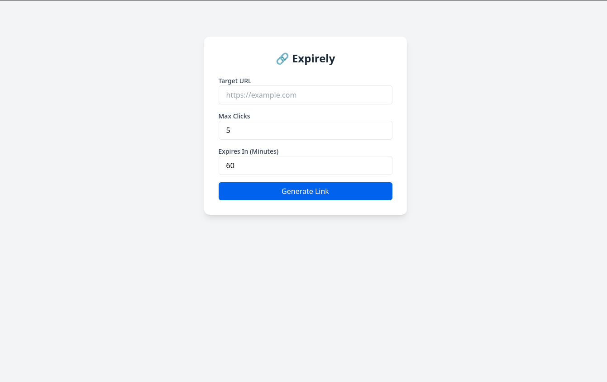
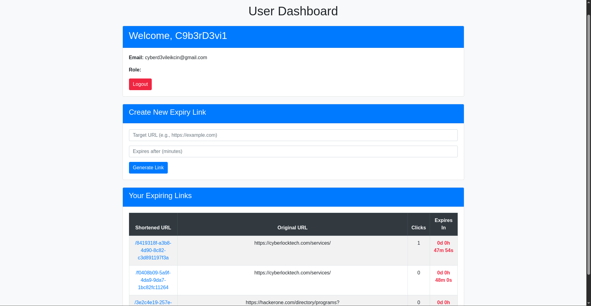
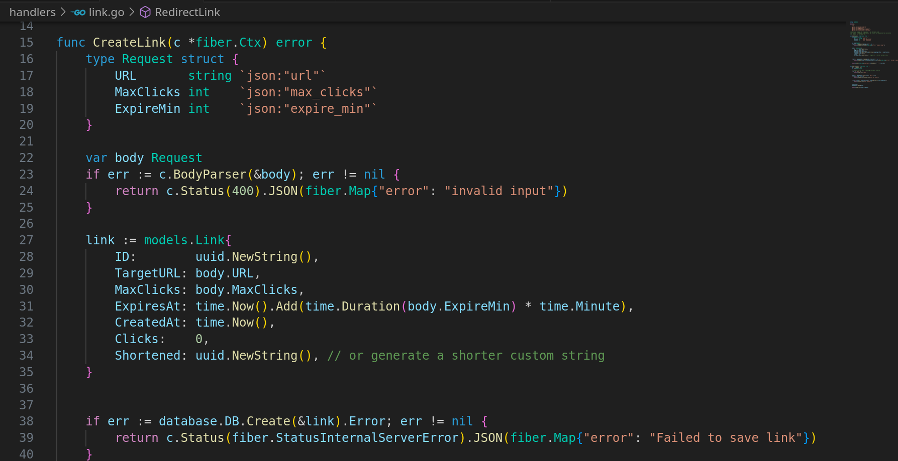

# 🔗 Burnr - Expiring Link Shortener

Burnr is a simple, fast, and privacy-focused link shortener built with [Go Fiber](https://gofiber.io/). It allows users to shorten URLs with optional expiration settings (by time or click count). Once expired, the links automatically stop working.

## 🚀 Features

    - 🔐 Expiring links based on:
    - Time (specific expiration datetime)
    - Maximum click count
    - 📊 Click tracking per link
    - 🧠 Admin dashboard to monitor all links
    - ⚙️ Fiber-based backend with HTML templates
    - 💾 SQLite/PostgreSQL (GORM ORM)
    - 🔁 Optional live-reload support with `air`

## 📸 Demo Screenshot

## 📦 Tech Stack

    - Backend: Go (Fiber)
    - ORM: GORM
    - Templating: HTML (with Go templates)
    - DB: SQLite (can support PostgreSQL/MySQL)
    - Dev Tools: `air` (optional)

    ---

## 📂 Project Structure

    Burnr/
    ├── handlers/ # Request handlers
    ├── models/ # GORM data models
    ├── views/ # HTML templates
    ├── database/ # DB connection logic
    ├── tmp/ # Temp binary files (air)
    ├── main.go # App entry point
    └── README.md

## 🛠️ Setup & Installation

### 1. Clone the Repo

    git clone https://github.com/C9b3rD3vi1/Burnr.git

    cd Burnr

2. Install Dependencies

Make sure you have Go 1.18+ installed.

    go mod tidy

3. Configure Database

Edit database/connect.go to configure your SQLite/PostgreSQL connection (SQLite by default).

4. Run the App

    go run main.go

Or use air for hot-reloading (if installed):

    air

🌐 Usage

Home Page
Submit a URL, set expiration time or max clicks → get a shortened link like:

http://localhost:3000/abc123

Admin Panel

Visit /admin to see all shortened links with their metadata (clicks, expiration time).

🧪 API Endpoints

    ***Method	Route	Description***

        POST	/create	Create a new short URL
        GET	/:id	Redirect to original URL
        GET	/admin	Admin dashboard (HTML rendered)

⚙️ Environment Variables (optional)

If you want to move to .env config:

env

    PORT=3000
    DATABASE_URL=file::memory:?cache=shared

Use godotenv to load it.

🧑‍💻 Contributing

Fork this repo

Create a new branch (***git checkout -b feature-name***_)

Commit your changes

Push to your fork

Create a Pull Request

***Visit the link below to see the project in action!***_

<https://burnr-ds4j.onrender.com/>